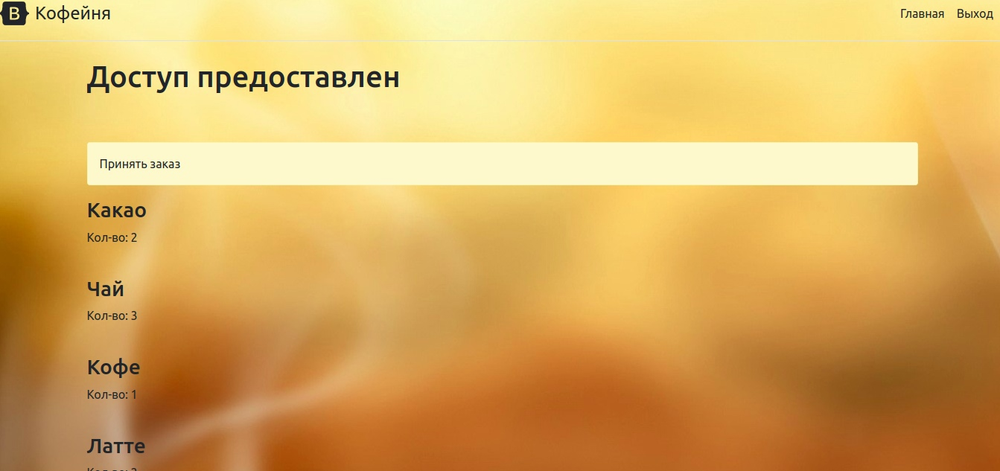

## Coffee sales system
To start a local server on which all user interaction will take place
, the following commands are required in the *linux* terminal:
```bash
git clone https://github.com/khoribz/SalesSystem.git
cd SalesSystem
docker-compose build
docker-compose up
```
The site is deployed using a web server and a mail proxy server - **Nginx** and an HTTP server with a Python web server gateway interface - **Gunicorn**    
Then you need to open the link *http://127.0.0.1:8000 /*<br>
To log in to the cashier's account, you can use the login:*student*, password:*sugar123**

The program uses the **Model-View-Controller (MVC)** architectural pattern, the essence of which is to divide
application data and logic control into three separate components: model, view and controller. 

The sqlite3 database is used in this project. Every order made is entered into it.

The **[order system](https://github.com/khoribz/SalesSystem/tree/master/order_system/order_system)** folder contains various installations for the project.<br>
**[main](https://github.com/khoribz/SalesSystem/tree/master/order_system/store)** - the main functionality of the project, interaction with the site is prescribed, the logic of the program.<br>
**[user](https://github.com/khoribz/SalesSystem/tree/master/order_system/user)** - the cashier's login settings.

## Website interface

## What does the website of the system for selling coffee look like?
**Home page**

On the right are the buttons "Home", "Login" (for the cashier) and "Admin" - administrator authentication.

**Admin Panel** 

**Interface for the cashier** 

Each order is displayed on the screen. To place an order, you need to click on the "Accept order" button.


