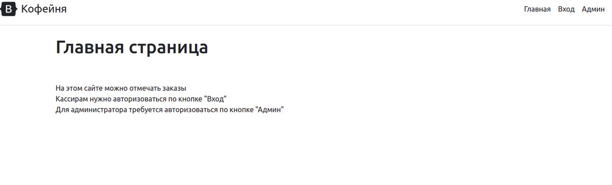
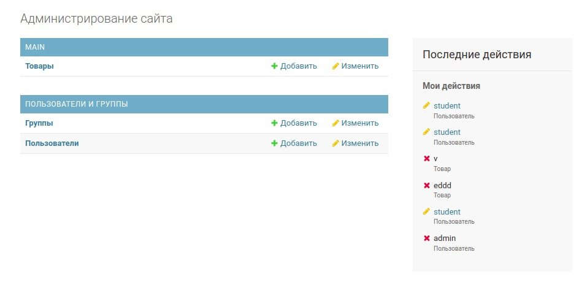
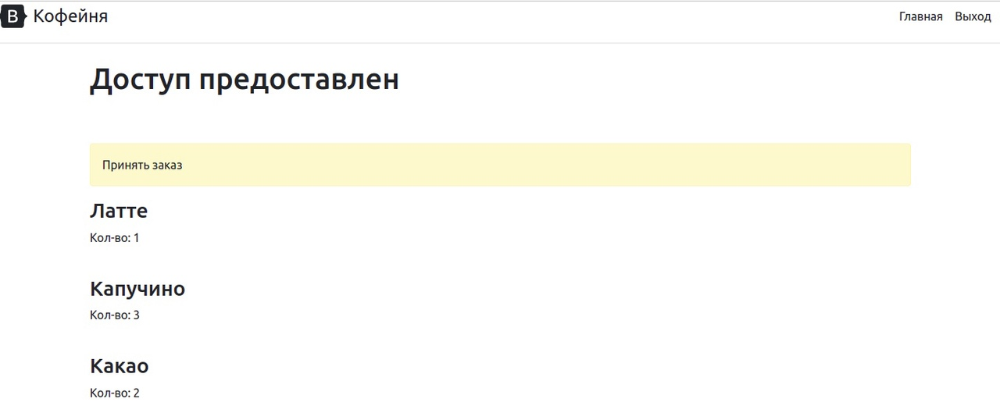

## Система продажи кофе
Чтобы запустить локальный сервер, на котором будет происходит все взаимодействие с пользователем
, необходимо в терминале *linux* следующие команды:
```bash
git clone https://github.com/khoribz/SalesSystem.git
cd SalesSystem
pip3 install -r requirements.txt
python3 manage.py runserver
```  
Затем нужно открыть ссылку *http://127.0.0.1:8000/*<br>
Для создания учетной записи администратора следует прописать 
```bash
python3 manage.py createsuperuser
```  
и ввести логин с паролем<br>
Для входа в аккаунт кассира можно использовать логин:*student*, пароль:*sugar123**

В программе использован архитектурный паттерн Model-View-Controller (MVC), суть которого в разделении
данных приложения и управления логики на три отдельных компоненты: модель, представление и контроллер. 
Причина использования паттерна - независимость модификации каждой отдельной части.

Для проекта использован фреймворк  Django для веб-приложений на язык Python.
В выбранном фреймворке роль модели выполняют файлы **models.py**, представления - файлы папки **templates**,
контроллера - **views.py**

В данном проекте использована база данных sqlite3. Каждый сделанный заказ заносится в нее.

В папке **order_system** находятся различные установки для проекта.<br>
**main** - основной функционал проекта, прописывается взаимодействие с сайтом, логика программы.<br>
**user** - настройки входа кассира в систему.

## Интерфейс сайта 

## Как выглядит сайт системы для продажи кофе?  
**Главная страница**

Справа расположены кнопки "Главная", "Вход" (для кассира) и "Админ" - аутентификация администратора.

**Панель администратора** 

Здесь можно добавлять новых пользователей, смотреть данные о заказах.


**Интерфейс для кассира** 

Каждый заказ отображается на экране. Чтобы оформить заказ, нужно нажать на кнопку "Принять заказ".


