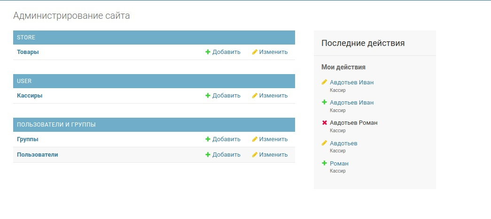

## Система для кассира
Для запуска в терминале нужно выполнить следующие команды:
```bash
git clone https://gitlab.com/khoribz/cashiersystem.git
cd cashiersystem
pip3 install -r requirements.txt
python3 manage.py runserver
```  
Сайт доступен по ссылке http://127.0.0.1:8000 *<br>*
Чтобы создать администратора пропишите:
```bash
python3 manage.py createsuperuser
```  
и введите пароль.  
Вход для кассира: логин - *student*, пароль - *sugar123**  
Вход для администратора: логин - *siteAdmin*, пароль - *intern*  

## Интерфейс
**Домашняя страница**

Справа вверху есть вкладки Главная, Вход(для кассира), Админ

**Панель администратора**


**Панель кассира**


